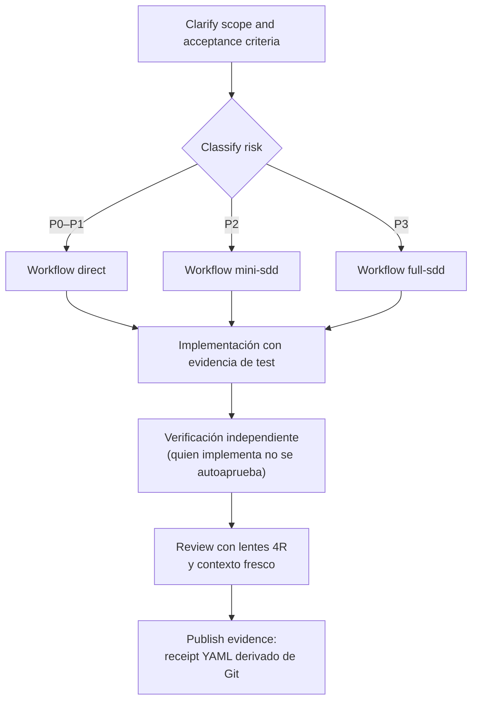

# Dreamcoder DSH


[](LICENSE)
[](https://github.com/Dreamcoder08/dreamcoder-dsh/actions/workflows/ci.yml)
[](https://github.com/Dreamcoder08/dreamcoder-dsh/stargazers)
[](https://github.com/Gentleman-Programming/gentle-ai)
[](https://github.com/Gentleman-Programming/gentle-pi)
[](#arquitectura)
[](https://pnpm.io)
[](https://nodejs.org)

**Convierte DeepSeek Harness en un entorno de ingeniería disciplinado, sin tocar su core.**

Dreamcoder DSH instala la **capa operativa de ingeniería Gentle-AI** como *bundle
out-of-tree*: un pipeline de diez etapas obligatorias, clasificación de riesgo
P0–P3 antes de tocar código, subagentes con roles separados (quien implementa
jamás se autoaprueba), TDD con evidencia observable, receipts derivados de Git,
presupuestos de contexto, routing explícito de modelos y autonomía acotada.

DeepSeek Harness ya tiene herramientas potentes. Este bundle añade la disciplina
para usarlas bien: mantiene la evidencia de revisión derivada de Git en lugar de
la narración del agente, y deja las decisiones de entrega en la política ordinary
del repositorio.

Es el paquete hermano de [`gentle-pi`](https://github.com/Gentleman-Programming/gentle-pi)
dentro del [ecosistema Gentle-AI](https://github.com/Gentleman-Programming/gentle-ai):
misma filosofía, otro host. Donde `gentle-pi` disciplina a Pi, este bundle
disciplina a DeepSeek Harness mediante perfiles, bundles Cordis, skills y
agent presets — todo instalable, verificable y reversible.

## El problema

La mayoría de las sesiones con agentes de código fallan por razones operativas,
no por limitaciones del modelo:

- el agente salta al código antes de entender objetivo y alcance;
- las decisiones arquitectónicas se pierden en el historial del chat;
- una petición simple se convierte silenciosamente en un diff multi-módulo;
- los tests corren tarde, o nunca;
- quien revisa recibe un muro de cambios sin clasificación de riesgo;
- hay subagentes disponibles, pero nadie orquesta con contexto fresco;
- el implementador es juez y parte: se autoaprueba.

Ninguna de estas fallas se arregla con un mejor modelo. Se arreglan con
**proceso observable**: clasificar antes de actuar, verificar con independencia
y publicar evidencia en lugar de relato.

Dreamcoder DSH arregla el proceso alrededor del agente.

## Qué añade

| Capa | Mecanismo | Qué aporta |
|---|---|---|
| **Identidad operativa** | fila `system-prompt` del bundle | Persona de ingeniería con pipeline de 10 etapas, reglas de evidencia y jerarquía de permisos P0–P5 |
| **Routing de trabajo** | skill `workflow-router` | Clasificación P0–P3 antes de tocar código y elección del workflow mínimo seguro (`direct`, `mini-sdd`, `full-sdd`) |
| **Delegación disciplinada** | 6 agent presets | `explorer`, `architect`, `implementer`, `tester`, `reviewer`, `security` — roles con permisos acotados y separación estructural implementar/verificar |
| **TDD con evidencia** | skill `tdd-evidence` + `scripts/red-green.ts` | Ciclo RED→GREEN→TRIANGULATE→REFACTOR capturado en `<repo>/.evidence/`; sin salida real no hay TDD |
| **Revisión 4R** | skill `review-4r` | Lentes Readability/Reliability/Resilience/Risk con contexto fresco; jamás aprueba por cortesía |
| **Receipts de cierre** | skill `evidence-ledger` + `scripts/evidence-ledger.ts` | Recibo YAML derivado de Git (SHAs, scope, checks) cerrado con SHA256; sin recibo no hay misión completa |
| **Memoria longitudinal** | skill `memory-gate` + overlay Engram opcional | Gate que decide qué merece persistirse; solo el orquestador lee/escribe memoria |
| **Routing de modelos** | skill `model-router` | Decisión explícita `rol → riesgo → modelo → esfuerzo`; nada de defaults silenciosos; providers externos codex/claude-code |
| **Presupuesto de contexto** | política §7 + `scripts/context-governor.ts` | Franjas de presupuesto por misión y compactación antes de que degrade la calidad |
| **Autonomía acotada** | política §9 + skill `autonomous-mission` | Goals persistidos + jobs en segundo plano con límite de rounds fijado antes de empezar |
| **Seguridad mecánica** | `scripts/security-gate.ts` + hooks | Deny-list P5, rutas sensibles bloqueadas, hook pre-commit anti-secretos y bypass auditable fail-closed |
| **Salud y observabilidad** | `scripts/dream-doctor.sh` + `scripts/dream-metrics.ts` | Diagnóstico de instalación en 13 chequeos y métricas derivadas de Git |

## Arquitectura

```text
        Filosofía Gentle-AI + contrato operativo de ingeniería
                            │
          @dreamcoder/dsh-engineering-bundle   ← este repo
                            │
                  DeepSeek Harness (dsh)
                            │
          ┌─────────────────┼──────────────────┐
       bundle base      bundle web-app    presets/skills propios
```

El bundle es un patch Cordis (`bundles/engineering/cordis.patch.yml`) aplicado
sobre el árbol compuesto `base + web-app`. Dos decisiones de diseño:

1. **Overrides con reemplazo completo.** Cada override restituye toda la
   configuración que quiere conservar (no hay deep-merge); esto hace el patch
   determinista y auditable en una sola lectura.
2. **Portabilidad sin rutas absolutas.** El bundle no registra
   `customSkillDirs`: `scripts/install.sh` enlaza cada skill en la raíz de
   usuario por defecto de dsh-skill-filesystem (`$DSH_HOME/skills`), así el
   patch no contiene rutas dependientes de la máquina.

Detalle completo en [`docs/architecture.md`](docs/architecture.md).

### Mapa del repositorio

| Ruta | Contenido |
|---|---|
| `bundles/engineering/` | Bundle instalable: patch Cordis (fila `system-prompt`) |
| `bundles/engineering/skills/` | Las 7 skills curadas del bundle |
| `agents/` | Seis agent presets (`preset.yml` + `agent.cordis.yml`) |
| `workflows/` | Documentos `direct.md`, `mini-sdd.md`, `full-sdd.md` |
| `policy/AGENTS.md` | Contrato operativo global → se instala en `~/.dsh/AGENTS.md` (con backup) |
| `profiles/engineering/` | Manifiesto del perfil: `base` + `web-app` + este bundle |
| `memory/engram.cordis.yml` | Overlay opcional de memoria longitudinal (Engram vía MCP) |
| `contracts/` | Contratos machine-readable de las etapas SDD, verificados contra los workflows |
| `bench/` | Corpus de journeys para el mini-bench en modo driven |
| `scripts/` | Instalador, doctor, gates, red-green, evidence-ledger y verificadores |
| `hooks/` | Plantilla de hooks Claude Code para el puente opcional |
| `docs/` | Referencia de arquitectura, skills y troubleshooting |

## Instalación

Requisitos:

- instalación base de DeepSeek Harness (`dsh`)
- [pnpm](https://pnpm.io) 11.22.0 como gestor de paquetes único
- Node ≥ 26 para el tooling TypeScript nativo
- Opcional: binario `engram` v1.20.0 en PATH si vas a habilitar memoria

```bash
git clone <este-repo> dreamcoder-dsh && cd dreamcoder-dsh
pnpm install                            # dependencias de desarrollo (tsgo, @types/node)

bash scripts/install.sh                 # instala perfil, política y presets (idempotente)
bash scripts/install.sh --with-engram   # además habilita memoria Engram (requiere binario)
bash scripts/install.sh --with-hooks    # además hook pre-commit anti-secretos + pre-push
```

Qué hace el instalador:

1. Compone e instala el perfil `engineering` en `$DSH_HOME/profiles/`.
2. Instala `policy/AGENTS.md` en `$DSH_HOME/AGENTS.md`, respaldando cualquier
   versión previa como `AGENTS.md.backup.<timestamp>`.
3. Publica los seis agent presets en `$DSH_HOME/.agent-presets`.
4. Enlaza las 7 skills en `$DSH_HOME/skills`.
5. Con `--with-engram`, registra el overlay MCP `memory/engram.cordis.yml`.

`DSH_HOME` respeta su valor de entorno (default: `~/.dsh`); la instalación es
idempotente y puede re-ejecutarse sin efectos residuales.

Paquetes recomendados del ecosistema:

```bash
# El hermano Pi-native, si también usas Pi:
# https://github.com/Gentleman-Programming/gentle-pi
```

## Inicio rápido

```bash
bash scripts/dream-doctor.sh   # salud de la instalación (13 chequeos)
dsh --profile engineering      # arranca la sesión disciplinada
```

Flujo típico:

1. Ejecuta `dream-doctor.sh` y confirma que los 13 chequeos pasan.
2. Arranca `dsh --profile engineering`. Los presets aparecen en el selector de agentes.
3. Pide cualquier tarea: la skill `workflow-router` la clasifica (P0–P3) y elige
   el workflow mínimo seguro — el proceso es proporcional al riesgo, no ritual.
4. Cada misión P≥1 cierra con un receipt (`evidence-ledger`) bajo `.evidence/`.

Verificación del tooling sin instalar nada:

```bash
pnpm verify          # compone el perfil y valida presets y contratos (verify-compat + verify-presets + verify-contracts)
pnpm typecheck       # tsgo 7.x (TypeScript nativo) sobre todo el tooling
```

Todo el tooling del bundle es TypeScript estricto ejecutado con Node —TS nativo
sin build step— tipado con la línea 7.x del compilador nativo
(`@typescript/native-preview`, `tsgo`).

## Cómo decide el harness qué hacer

Toda tarea recorre el mismo pipeline de diez etapas: **Architect → Clarify →
Classify risk → Select workflow → Retrieve context → Delegate → Implement →
Verify independently → Review → Publish evidence**. Ninguna etapa se omite en
silencio: si no aporta (p. ej. Clarify en un typo), se declara omitida en una
línea del reporte.

El objetivo no es ceremonia: es evitar el caos accidental. La clasificación de
riesgo decide cuánto proceso aplica:

| Nivel | Definición | Ejemplo | Workflow |
|---|---|---|---|
| **P0** trivial | Sin lógica ni dependencias | typo, comentario, docs | `direct` |
| **P1** scoped | Cambio local acotado, con test | fix puntual + unit test | `direct` + test |
| **P2** substantial | Feature o refactor multi-archivo | endpoint nuevo con tests | `mini-sdd` |
| **P3** architectural | Diseño y contratos | esquemas, migraciones, CI | `full-sdd` |

Regla de oro ante duda entre dos niveles: gana el más alto. Y si la tarea real
excede su nivel declarado, se reclasifica antes de continuar.



### Disparadores de delegación

El orquestador mantiene su sesión delgada y delega en el punto más estrecho
útil:

| Disparador | Comportamiento requerido |
|---|---|
| Leer 4+ archivos para entender un flujo | Lanzar `explorer`: exploración de solo lectura con hallazgos citados |
| Tocar 2+ archivos de código no triviales | Delegar a un único `implementer`; no continuar inline salvo indisponibilidad |
| Misión larga (~20 tool calls, 5 lecturas exploratorias o 2 edits no mecánicos) | Pausar y delegar el resto, o detenerse explicando el bloqueo exacto |
| Presión de contexto (`context:warning` / `context:critical`) | Cerrar la unidad en curso y compactar antes de seguir |
| Operación P4/P5 o decisión no contemplada | Escalar a humano; nunca envolverla en un script mayor |

El loop equilibrado para un bugfix acotado:

```text
parent clarifica y clasifica → un worker escribe el fix autorizado →
verificación enfocada (tester) → review 4R → parent publica receipt
```

## Skills incluidas

| Skill | Trigger | Qué garantiza |
|---|---|---|
| `workflow-router` | tarea nueva sin clasificar | Riesgo asignado antes de tocar código; workflow mínimo seguro |
| `tdd-evidence` | TDD estricto, RED/GREEN | Salida observada de cada fase; sin salida real no hay TDD |
| `review-4r` | code review, dual review | Hallazgos con evidencia bajo 4 lentes; jamás aprueba por cortesía |
| `evidence-ledger` | cierre de misión, receipt | Recibo YAML verificable derivado de Git; sin recibo no hay cierre |
| `memory-gate` | inicio/cierre de tarea | Solo persiste lo reutilizable; solo el orquestador accede a memoria |
| `model-router` | delegación, cambio de fase | Modelo y esfuerzo elegidos por rol y riesgo, registrados |
| `autonomous-mission` | misión larga, overnight | Límites duros fijados antes de empezar; escalado honesto a humano |

Referencia completa con contratos de activación:
[`docs/skills-reference.md`](docs/skills-reference.md).

## Agent presets

Seis roles con permisos y responsabilidades separados — la separación
implementa / verifica es estructural, no disciplinaria:

| Preset | Responsabilidad | Límite duro |
|---|---|---|
| `explorer` | Exploración de solo lectura con hallazgos citados | Sin shell ni escritura |
| `architect` | Diseño y planes decision-completos en plan mode | Sin mutación del repo |
| `implementer` | Único rol que implementa cambios | Jamás se autoaprueba |
| `tester` | Verificación independiente: suites y reproducción de fallos | Solo escribe tests, nunca el fix |
| `reviewer` | Revisión 4R con contexto fresco | Veredicto APPROVED / CHANGES_REQUIRED |
| `security` | Auditoría ofensiva/defensiva del cambio | Veredicto PASS / FAIL con evidencia |

## Comandos

| Comando | Qué hace |
|---|---|
| `bash scripts/install.sh` | Instalación idempotente del perfil, política y presets (preserva dependencias opcionales ya instaladas) |
| `bash scripts/install.sh --with-engram` | Ídem + overlay de memoria Engram |
| `bash scripts/install.sh --with-hooks` | Ídem + hook pre-commit anti-secretos y hook pre-push (suite completa antes de publicar) |
| `/dream-doctor` · `/dream-status` | Comandos in-session de la GUI (tras reiniciar dsh): corren doctor y métricas sin salir de la sesión |
| `bash scripts/dream-doctor.sh` | Salud de la instalación en 13 chequeos (seguridad, vanguardia y procedencia SHA-256) |
| `pnpm verify` | Compatibilidad contra DSH pineado + validación de presets + contratos |
| `pnpm bench` | Mini-bench MODO DRIVEN: ejecuta los journeys de `bench/` y deja recibo en `.evidence/bench-latest.json` · `--list` muestra el corpus sin ejecutar · `--json` emite un objeto JSON machine-readable por stdout (CI/tooling) · `--only j1,j2` subset |
| `pnpm typecheck` | `tsgo --noEmit` sobre todo el tooling |
| `node scripts/red-green.ts` | Ciclo TDD completo RED→GREEN→TRIANGULATE→REFACTOR con evidencia |
| `node scripts/evidence-ledger.ts` | Receipt de misión derivado de Git; `--sdd <misión>` exige el gate SDD |
| `node scripts/security-gate.ts` | Gate P0–P5: bloquea P5 y rutas sensibles; bypass auditable |
| `node scripts/sdd-gate.ts` | Orden de etapas SDD exigido en runtime (contratos machine-readable) |
| `node scripts/sdd-specs.ts` | Specs canónicas SDD: `new`/`sync`/`archive` alineadas al contrato; SHA-256 en el índice de archivo |
| `node scripts/context-governor.ts` | Lee el uso real de sesión y emite `context:ok\|warning\|critical` como gate componible |
| `node scripts/skill-router.ts` | Presupuesto de skills: top-3 por relevancia, resto diferido |
| `node scripts/update-guard.ts` | Vanguardia: pin local vs última release upstream (cache offline) |

## Seguridad con dientes

Las reglas de permisos (§3–§4 de la política) tienen enforcement mecánico, no
solo texto:

- **security-gate** clasifica cada comando contra la jerarquía P0–P5 y bloquea
  los patrones destructivos canónicos (`rm -rf`, `git reset --hard`,
  `push --force`, drops de base de datos…) y las rutas sensibles
  (`~/.ssh/`, `.env`, claves privadas).
- **Hook pre-commit** (`install.sh --with-hooks`) impide commitear rutas
  sensibles y claves privadas en el diff staged.
- **Bypass auditable**: el único escape es `DC_SECURITY_BYPASS="quién aprobó y
  cuándo"`, registrado en `.evidence/security-gate-audit.jsonl`; si la traza no
  puede escribirse, el bypass se deniega (fail-closed).
- **sdd-gate**: saltarse una etapa del workflow elegido falla mecánicamente
  (`advance` valida orden contra `contracts/*.json`); `evidence-ledger --sdd`
  niega el receipt a misiones incompletas.

No sustituye el criterio humano: cubre la superficie determinable.

Referencia completa — jerarquía P0–P5, rutas sensibles, bypass auditable, hooks
y modelo de amenazas: [`docs/security.md`](docs/security.md).

## Evidencia y receipts

> **Confía en lo que el sistema puede derivar, no en lo que el agente afirma.**
> Los agentes analizan el cambio. El recibo lo deriva Git.

La regla central: **ninguna afirmación de "hecho", "funciona" o "roto" sin
evidencia observable** — salida de test, `git diff`, exit code. "Debería
funcionar" es hipótesis, no resultado.

- `red-green.ts` observa el ciclo TDD completo y deja registro en
  `<repo>/.evidence/`; un test que nunca se vio rojo no prueba el fix.
- `evidence-ledger.ts` deriva el recibo del estado real de Git (SHAs, scope,
  checks) y lo cierra con SHA256: el relato del agente no participa.

Cuando sea barato, el flujo exige demostrar el par fallo→paso.

Referencia completa — ciclo TDD observado, campos del receipt, sdd-gate,
mini-bench driven y presupuesto de contexto:
[`docs/evidence.md`](docs/evidence.md).

## Memoria

Persisten las decisiones arquitectónicas y su porqué, invariantes, comandos
canónicos y descubrimientos costosos. No persiste salida cruda, estados de
depuración ni secretos — jamás. La skill `memory-gate` decide en cada cierre;
solo el orquestador recupera memoria y la inyecta en los prompts de sus
subagentes. El overlay Engram (MCP) es opcional: si no está compuesto, se
declara una vez y se opera sin memoria longitudinal — nunca se simula.

## Roadmap

Fases implementadas:

- **M0–M3** baseline · identidad/política · skills/presets · routing de workflows.
- **M4** memoria: gate + overlay Engram opcional.
- **M5** TDD con evidencia observable del ciclo completo (RED→GREEN→TRIANGULATE→REFACTOR).
- **M6** revisión 4R con contexto fresco (presets reviewer/security).
- **M7** evidence ledger con SHA256 derivado de Git (+ gate SDD opcional vía `--sdd`).
- **M8** context governor: presupuestos (política §7) + gate mecánico `scripts/context-governor.ts` con eventos `context:ok|warning|critical` y contratos por etapa en `contracts/` verificados contra los workflows.
- **M9** model routing explícito (política §8 + skill `model-router`), con routing por transporte y **providers externos codex/claude-code operativos** (`bash scripts/install.sh --with-external-subagents`; delegación cross-engine verificada end-to-end vía codex).
- **M10** observabilidad: `dream-doctor.sh` (12 secciones en su origen; 13 hoy) + `dream-metrics.ts` (tokens/task aprox, rework % derivado de Git, ciclos COMPLETE) + registros en `.evidence/`.
- **M11** autonomía acotada: goals persistidos + jobs con límites duros (§9).
- **M12** mini-bench driven: corpus de journeys `bench/` + runner `scripts/dream-bench.ts` — los tests validan declaraciones, solo el modo driven prueba ejecución (recibo en `.evidence/bench-latest.json`).
- **M13** specs canónicas SDD: `scripts/sdd-specs.ts` persiste la spec de cada misión alineada con su contrato (`sync`) y la archiva con SHA-256 (`archive`, fail-closed).
- **M14** hook bridge Claude Code (parcial): `scripts/cc-hook-guard.ts` + `hooks/claude-hooks.template.json` + flag `install.sh --with-hook-bridge` listos; la ACTIVACIÓN del puente queda bloqueada por empaquetado upstream — `@deepseek-ai/dsh-hooks-claude-code` declara deps `workspace:^` de paquetes sin publicar en npm, imposibles de resolver fuera del monorepo DSH. El instalador falla RUIDOSO nombrando el paquete; se reactiva cuando upstream publique.

Enforcement mecánico (misión "10/10"):

- **security-gate**: la jerarquía P0–P5 (§3–§4) tiene dientes — deny-list P5,
  rutas sensibles bloqueadas, hook pre-commit y escape auditable vía
  `DC_SECURITY_BYPASS`.
- **sdd-gate**: saltarse una etapa del workflow elegido falla mecánicamente
  (`advance` valida orden contra `contracts/*.json`); `evidence-ledger --sdd`
  niega el receipt a misiones incompletas.
- **skill-router**: el presupuesto "máx 3 skills" (§10) es ejecutable, no
  disciplina textual.
- **update-guard**: estar en la vanguardia se verifica contra upstream (tags
  de GitHub), con cache offline para CI.
- **installer idempotente**: preserva dependencias opcionales entre corridas;
  el doctor detecta patches huérfaos ("entry not found").

Pendiente conocido:

- Los receipts viven como scripts+skills out-of-tree; un plugin TS propio del
  bundle (fila cordis que emita el recibo como evento de sesión) queda como
  evolución cuando DSH estabilice su API de plugins de terceros.
- El routing por fase es hoy decisión declarada del orquestador; el pinning
  per-preset de modelo requiere cambios host-plane upstream.

## Principios

1. **Evidencia sobre relato.** Sin salida observable, no está hecho.
2. **Proceso proporcional al riesgo.** Ni todo en SDD, ni el proceso en ritual.
3. **Separación implementar/verificar.** Quien implementa no se autoaprueba.
4. **Contexto es presupuesto.** Se administra; nunca se agota en silencio.
5. **Out-of-tree siempre.** El core de DSH no se modifica; todo es instalable,
   verificable y reversible.
6. **Autonomía es control verificado**, no ausencia de supervisión.

## Desarrollo

```bash
pnpm install && pnpm typecheck && pnpm test && pnpm verify
```

La integración continua ([`.github/workflows/ci.yml`](.github/workflows/ci.yml))
ejecuta dos jobs: `tooling` (gate duro: typecheck + mini-bench host-free +
vanguardia offline + integridad de enlaces y rutas de la documentación) y
`composition` (best-effort: requiere una instalación local de `dsh`; el gate
autoritativo sigue siendo tu máquina con `pnpm verify` + `dream-doctor.sh`).

Para contribuir, lee [CONTRIBUTING.md](CONTRIBUTING.md). El historial de
cambios vive en [CHANGELOG.md](CHANGELOG.md). Para proponer cambios upstream al
ecosistema Gentle-AI (issue-first):
[`docs/contribution-gentle-ai.md`](docs/contribution-gentle-ai.md) ·
[versión en inglés](docs/contribution-gentle-ai.en.md).

Si un problema te bloquea, [`docs/troubleshooting.md`](docs/troubleshooting.md)
reúne los fallos conocidos y sus salidas exactas.

## Licencia

[Apache-2.0](LICENSE).
