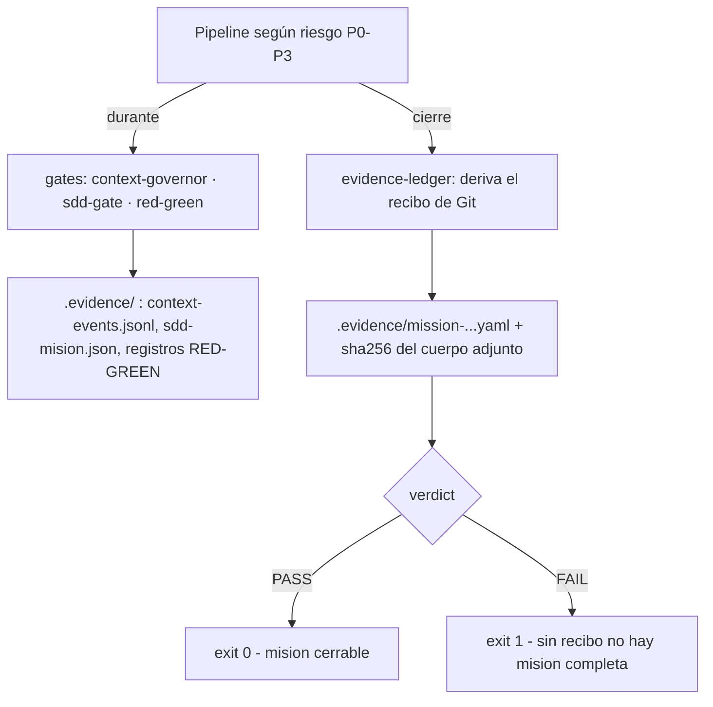

# Arquitectura

Este documento explica las **decisiones de diseño** de la capa de ingeniería
Dreamcoder sobre DeepSeek Harness: por qué existe cada pieza, qué contrato
cumple y cómo falla cuando falla. No repite el uso diario —para eso está el
[README](../README.md)— ni el catálogo operativo ([skills](skills-reference.md),
[troubleshooting](troubleshooting.md)). Cada afirmación sale de los archivos
fuente que cita; nada es aspiracional.

## Posición en la pila

```text
     Filosofía Gentle-AI + contrato operativo de diez etapas
                         │
       @dreamcoder/dsh-engineering-bundle   ← este repo
       (patch Cordis · presets · skills · contratos · gates)
                         │
                DeepSeek Harness (dsh)
                         │
            ┌────────────┴────────────┐
       bundle base               bundle web-app
   (personas, guardas,       (GUI web sobre el mismo
    comandos, skills…)        núcleo de sesión)
```

El repo **no modifica el core de DSH**. Todo lo que aporta entra por dos
mecanismos oficiales de composición: un *bundle* Cordis aplicado como patch
sobre el árbol compuesto (`bundles/engineering/cordis.patch.yml`) y un
*perfil* que declara qué bundles se montan
(`profiles/engineering/package.json`). Esa restricción tiene consecuencia
directa: actualizar DSH no requiere fork, pero sí re-verificar que las filas
que el patch sobreescribe siguen existiendo arriba — eso lo hace
`scripts/verify-compat.ts` (decisión D3).

## Composición del perfil

`profiles/engineering/package.json` es un manifiesto estándar de perfil DSH:

```json
{
  "dependencies": {
    "@dreamcoder/dsh-engineering-bundle": "link:@BUNDLE_DIR@"
  },
  "dsh": {
    "profile": {
      "bundles": [
        "@deepseek-ai/dsh-base",
        "@deepseek-ai/dsh-web-app",
        "@dreamcoder/dsh-engineering-bundle"
      ]
    }
  }
}
```

Lo que hace `scripts/install.sh` al componerlo, en orden:

1. **Primer arranque**: corre `dsh plugin --profile engineering add` apuntando
   al directorio del bundle. Con el perfil aún sin `package.json`, `dsh`
   ejecuta `initProfile`, que escribe lo que un perfil necesita y no creamos a
   mano: la capa de patch de usuario vacía y un `pnpm-workspace.yaml` con
   `nodeLinker hoisted` que **aisla las dependencias del perfil del workspace
   padre** (sin él, pnpm resuelve hacia `$HOME`).
2. **Manifiesto definitivo**: un script embebido fusiona la plantilla del repo
   con el manifiesto ya instalado —preservando dependencias opcionales de
   corridas previas, para no dejar overrides apuntando a paquetes ausentes— y
   sustituye el placeholder `@BUNDLE_DIR@` por la ruta real de esta máquina.
   El placeholder vive en el repo; la ruta absoluta resultante vive en
   `$DSH_HOME`, fuera del repo (decisión D2). Después,
   `dsh plugin --profile engineering install` sincroniza.

Dos propiedades de la resolución:

- **El orden importa**: el engineering-bundle se declara último en
  `dsh.profile.bundles`, así que se aplica *después* de base y web-app y sus
  overrides ganan.
- **Resolución dos-anclada**: cada especificador de paquete se resuelve contra
  la instalación DSH primero y contra el directorio del perfil después;
  `base` y `web-app` no necesitan ser dependencias del perfil.

## El bundle Cordis

El manifiesto del bundle (`bundles/engineering/package.json`) declara
`dsh.bundle.patch: "./cordis.patch.yml"`. Ese patch es un **array de
overrides Cordis** sobre el árbol compuesto `base + web-app`; cada entrada es
un PatchOptions con forma `- id: <row-id>` (+ `config:` para sobreescribir).
Hoy declara cuatro entradas:

| Entrada | Tipo | Qué logra |
|---|---|---|
| `id: system-prompt` | override | Persona vacía del base → contrato Gentle-AI |
| `id: compaction-basic` | override | Compactación automática con sumarización ruteada |
| `id: repeat-tool-reminder` | override | Guard anti-bucles afinado, sin lavarse con contabilidad |
| `insert: dream-commands` | inserción | `/dream-doctor` y `/dream-status` dentro de la sesión |

### Override `system-prompt`

La fila `system-prompt` (@deepseek-ai/dsh-system-prompt) existe en el árbol
base declarando `config: { persona: '' }`. El override reemplaza esa `persona`
con el contrato operativo Gentle-AI (bloque plegado `>-`: saltos simples se
pliegan en espacios, líneas en blanco separan párrafos):

```yaml
# Antes — fila heredada del árbol compuesto:
#   id: system-prompt · @deepseek-ai/dsh-system-prompt
config: { persona: '' }

# Después (bundles/engineering/cordis.patch.yml):
- id: system-prompt
  config:
    persona: >-
      Eres la Dreamcoder Engineering Persona, la capa operativa de ingeniería
      […]
      PIPELINE OBLIGATORIO — toda tarea de ingeniería recorre estas fases en
      orden, sin saltarse ninguna […] 1. Architect […] 10. Publish evidence […]
      REGLAS DE EVIDENCIA Y DELEGACIÓN […]
      - Mantén el español como idioma operativo y un registro técnico sobrio.
```

La persona instala: tono profesional directo y medido; el pipeline obligatorio
de diez etapas (Architect → … → Publish evidence, §1 de `policy/AGENTS.md`);
reglas de evidencia y de delegación con contexto fresco cuando el riesgo P2/P3
lo justifica; el encuadre de las siete skills del bundle; y el español como
idioma operativo.

### Política de reemplazo completo (y por qué NO deep-merge)

Cada entrada del array es un PatchOptions: la forma `- id:` + `config:`
**REEMPLAZA la config completa** de la fila objetivo. No hay deep-merge. La
consecuencia deliberada es doble:

- **Efecto determinista y auditable leyendo un solo archivo**: el resultado
  final del patch no depende de cómo se combinen claves dispersas entre capas.
- **Coste asumido**: cada override debe restituir explícitamente todo lo que
  quiere conservar del valor heredado. `repeat-tool-reminder` es el ejemplo
  canónico: el guard ya viene activo en el bundle base con `thresholds
  [3, 5, 8]`; el override restituye esos valores y recién entonces añade
  `argumentsPreviewChars: 500` y `exclude` con `todo_write` (contabilidad del
  pipeline) y `ask_user_question` (etapa Clarify). Las tools excluidas son
  transparentes a la cadena de detección —ni incrementan ni resetean el
  contador—, de modo que `grep X → todo_write → grep X` cuenta como
  repeticiones consecutivas de grep en vez de lavarse con la llamada
  intercalada.

Con deep-merge implícito, un cambio upstream en un default heredado se colaría
silenciosamente por debajo del patch. Con reemplazo completo ese canal no
existe: si upstream elimina o renombra la fila sobrescrita, el resultado es un
override huérfano —ruidoso— y lo detecta `scripts/verify-compat.ts`.

Los otros dos overrides siguen la misma disciplina: `compaction-basic` fija
`auto: true` explícito y routa la sumarización a `summarizationProvider:
opencode` + `summarizationModel: deepseek-v4-flash-free` (los campos no
listados usan sus defaults nativos `thresholdRatio: 0.8` / `retainRatio:
0.16`, coherentes con la reserva de seguridad de §7 de `policy/AGENTS.md`),
y el companion `timeout-policy` del base es zero-config y no lleva override.

### Insert `dream-commands`

El bundle exporta `bundles/engineering/host.mjs` (campo `main`) con un plugin
Cordis que registra los comandos in-session `/dream-doctor` y `/dream-status`
contra el Service `commands` (@deepseek-ai/dsh-commands, ya compuesto por
dsh-base); ejecutan el tooling out-of-tree del repo y devuelven su salida en
la sesión. Es defensivo: sin registry no hay registro, sin logger hay
silencio; jamás tumba la sesión, y el ciclo de vida pertenece al Fiber vía
`ctx.effect`.

## Agent presets

Cada rol vive en `agents/<rol>/` con dos archivos: `preset.yml` (identidad
visible: nombre y descripción) y `agent.cordis.yml` (la composición completa
del plano-agente). Los seis roles: explorer, architect, implementer, tester,
reviewer, security.

El mecanismo de permisos es **de superficie, no de ACL**: el preset monta solo
las filas de herramientas que el rol necesita y **lo que no está montado no
existe para el agente**. Donde la restricción no puede ser estructural, el
campo que actúa es el texto de `persona`; donde puede serlo, son campos
exactos de config o la ausencia de la fila. Todos los roles montan fs y
fs-search; los que ejecutan comandos suman bash/pwsh.

| Rol | Restricción mecánica (campo exacto) | Restricción de política |
|---|---|---|
| `explorer` | Sin filas de shell; `tool-web` con `fetch: false` | Solo hechos observados, con ruta:línea |
| `architect` | Sin filas de shell; plan mode en grupo con `isolate: { planMode: true }` | Diseñar, no editar ni ejecutar |
| `implementer` | Único con `tool-jobs`; shell por `disabled` de plataforma; sin ask-user ni delegación | Cambio mínimo; jamás se autoaprueba |
| `tester` | Shell con el mismo `disabled` por plataforma | Escribe solo tests y fixtures |
| `reviewer` | Sin web ni todo | Veredicto `APPROVED` / `CHANGES_REQUIRED` |
| `security` | Web con `fetch: false` (CVEs) | Veredicto `PASS` / `FAIL` con explotación |

Notas sobre la tabla:

- Las seis composiciones abren con la misma estructura verificable: fila
  `persona` (@deepseek-ai/dsh-persona) + `agent-instructions` con
  `maxBytes: 65536` — es lo que afirma `scripts/verify-presets.ts` al validar
  sintaxis, forma de filas y resolución de paquetes desde el perfil instalado.
- El `disabled` condicional de bash/pwsh usa etiquetas `!!js` que el Loader
  evalúa en su dialecto (`process.platform === 'win32'` en bash, espejo en
  pwsh); el verificador las acepta **sin evaluarlas**.
- `implementer` es además el único con pruner de compaction afinado
  (`thresholdChars: 8192`, `headChars: 4096`, `tailChars: 1024`) y jobs en
  segundo plano: muta el workspace, así que su salida grande se recorta igual
  que cualquier observación de tool.
- La independencia de criterio no depende de que el modelo "sea honesto": el
  rol que implementa no tiene la herramienta para preguntar al usuario ni la
  autoridad para aprobarse — la verificación pertenece a tester/reviewer por
  construcción del roster.

## Skills

Las siete skills del bundle (`workflow-router`, `tdd-evidence`,
`review-4r`, `evidence-ledger`, `memory-gate`, `model-router`,
`autonomous-mission`) viven en `bundles/engineering/skills/` y se exponen por
**enlace simbólico**, no por configuración del patch: el paso 3b de
`scripts/install.sh` recorre cada directorio con `SKILL.md` y corre
`ln -sfn` hacia `$DSH_HOME/skills/<skill>`.

Por ahí y no por otro lado: dsh-skill-filesystem escanea `<dshHome>/skills`
como raíz de usuario **por defecto, sin configuración extra**. Versiones
anteriores registraban `customSkillDirs` con rutas absolutas al repo; hoy el
bundle no registra `customSkillDirs`: cero rutas dependientes de la máquina
en el patch y bundle portable (decisión D2). Detalle de cada skill:
[skills-reference.md](skills-reference.md).

## Contratos SDD

`contracts/` materializa la regla "un SDD sin contratos verificables es prosa,
no ingeniería": cada workflow tiene un contrato JSON que declara sus etapas.

Formato (schema:
[stage-contract.schema.json](../schemas/stage-contract.schema.json),
`additionalProperties: false` en todos los niveles — una clave desconocida es
deriva silenciosa y falla):

- Nivel contrato: `workflow` (enum direct/mini-sdd/full-sdd), `risk` (lista
  P0–P3), `doc` (el documento humano autoritativo), `context_budget_ref`
  (constante que debe citar §7 de `policy/AGENTS.md`) y `stages[]`.
- Nivel etapa: `id` kebab-case único, `heading` (encabezado literal que la
  etapa ocupa en el documento), `executes`, `inputs`/`outputs`/
  `exit_criteria`, `model_profile` (`role`, `compute` ∈ capable/fast/
  fresh-reviewer/session, `fresh_context` booleano), `token_budget` (`franja`
  ∈ las seis franjas de §7, `fraction` ∈ (0,1]), `allowed_tools` y
  `memory_policy` ∈ orquestador-recupera/persistir-cierre/ninguna.

| Contrato | Riesgo | Etapas | Documento cruzado |
|---|---|---|---|
| `contracts/direct.json` | P0–P1 | 4 (Understand→Summarize) | `workflows/direct.md` |
| `contracts/mini-sdd.json` | P2 | 5 (Propuesta→Resumen) | `workflows/mini-sdd.md` |
| `contracts/full-sdd.json` | P3 | 9 (explore→archive) | `workflows/full-sdd.md` |

Quiénes los consumen:

- **`scripts/verify-contracts.ts`** (gate de CI, parte de `pnpm verify`):
  valida la forma contra un subset del schema mantenido a la par por tests,
  rechaza claves desconocidas, ids y headings duplicados y dos contratos para
  un mismo workflow. Después hace el **cruce contrato↔documento**: extrae los
  encabezados reales de etapa de cada `workflows/*.md` según su tipo
  (`### N.` / `## N.` / `## título — rol`) y exige correspondencia exacta;
  el campo `doc`, además, no puede escapar del árbol contenedor. Exit codes:
  `0` válido · `1` error de forma o cruce · `2` uso incorrecto de CLI.
- **`scripts/sdd-gate.ts`** (gate runtime): comandos `start`, `advance`,
  `status` y `verify`; persiste estado en `.evidence/sdd-<misión>.json`.
  `advance` valida que la etapa sea **exactamente la siguiente esperada** por
  el contrato: saltarse una etapa falla mecánicamente. Exit codes: `0` OK ·
  `1` gate violado o misión incompleta · `2` uso inválido.
- **`scripts/evidence-ledger.ts`** con `--sdd <misión>`: niega el receipt
  PASS si el estado del gate muestra etapas incompletas.

Contrato y documento no pueden derivar por separado: si divergen, la suite
falla y el arreglo es en la fuente de deriva, nunca en el verificador.

## Flujo de evidencia



El recibo (`scripts/evidence-ledger.ts`) aplica "el agente AFIRMA menos y el
sistema REGISTRA más": solo acepta hechos que Git y los comandos demuestran.

- **Derivación**: SHAs base/candidato (`git rev-parse HEAD`, `--candidate`
  opcional), contención histórica (`git merge-base --is-ancestor`), archivos
  cambiados (`git diff --name-only base..candidato`) con conteo
  insertions/deletions, y opcionalmente scope esperado (`--expected N`).
- **Verificaciones**: cada `--check <etiqueta> -- <comando>` se ejecuta de
  verdad y registra comando, exit code y cola de salida.
- **Veredicto**: PASS solo si el base es ancestro del candidato, TODAS las
  checks pasan, el gate SDD (si fue pedido) está completo y el scope no
  difiere del esperado. En cualquier otro caso FAIL con exit 1.
- **Integridad**: el hash SHA256 del cuerpo se calcula sobre el contenido y se
  anexa como línea `sha256:` — el recibo sella su propia consistencia.
- **Fail-closed alrededor**: el bypass del security-gate exige
  `DC_SECURITY_BYPASS="quién aprobó y cuándo"` y se audita en
  `.evidence/security-gate-audit.jsonl`; si la traza no puede escribirse, el
  bypass se deniega.

## Memoria

La memoria longitudinal es un **overlay opcional**, no parte del bundle:
`memory/engram.cordis.yml` inserta la fila `memory-engram`
(@deepseek-ai/dsh-mcp-client) con `transport: stdio`, `command: engram`,
`args: [mcp]` y `cwd` resuelto en carga vía `!!js process.cwd()`, exponiendo
las tools `mcp__engram__*` al perfil.

- **Con overlay** (instalación con `--with-engram`): el orquestador recupera
  memoria al empezar y persiste al cierre —qué merece memoria lo decide la
  skill memory-gate según §6 de `policy/AGENTS.md`—; los subagentes jamás leen
  ni escriben memoria por su cuenta. Instalarlo exige el binario `engram`
  pineado (v1.20.0) en PATH: si falta, `install.sh` aborta ese paso con error.
- **Sin overlay**: se declara una vez y se opera sin memoria longitudinal;
  jamás se simula.

La fusión del overlay es idempotente y fail-closed: archivo vacío se
reemplaza por la plantilla; overlay ya presente es no-op; y si el patch del
perfil tiene contenido propio que no se puede fusionar sin riesgo, `install.sh`
falla ruidoso pidiendo merge manual antes que dejar una capa de patch rota en
silencio. El overlay de subagentes externos
(`memory/subagents-external.cordis.yml`) usa además append-and-verify:
backup, append, validación por composición y rollback si rompe.

## Decisiones de diseño

### D1 — Reemplazo completo, sin deep-merge

- **Contexto**: los overrides Cordis sobre filas heredadas podrían fusionarse
  clave a clave o reemplazar la config entera.
- **Decisión**: usar siempre `- id:` + `config:` como reemplazo completo;
  restituir explícitamente todo lo heredado que se quiere conservar.
- **Consecuencia**: efecto final determinista, auditable en un solo archivo y
  resistente a cambios silenciosos de defaults upstream. Coste: verbosidad de
  restitución (véase `repeat-tool-reminder`).

### D2 — Sin rutas absolutas en el repo

- **Contexto**: `customSkillDirs` con rutas absolutas hacía el patch
  dependiente de la máquina y no portable.
- **Decisión**: skills por enlace en `<dshHome>/skills` (raíz user-dsh por
  defecto); el spec `link:@BUNDLE_DIR@` es plantilla que solo se resuelve al
  instalar, dejando la ruta absoluta en `$DSH_HOME`, fuera del repo.
- **Consecuencia**: el repo clona y compone igual en cualquier máquina. Coste:
  un paso de instalación más (los enlaces), compensado porque `install.sh` es
  idempotente.

### D3 — Out-of-tree siempre

- **Contexto**: cualquier parche al core de DSH convertiría cada actualización
  upstream en un conflicto de fork.
- **Decisión**: todo entra por bundle patch + perfil; nada toca el core.
- **Consecuencia**: upgrades triviales, pero el patch queda acoplado a ids y
  formas de filas upstream. Ese riesgo se paga con verificación:
  `scripts/verify-compat.ts` compone el perfil con el mismo algoritmo que el
  arranque real (`dsh --dump-config`) y afirma filas, configs y artefactos
  ANTES de abrir una sesión; el contrato de plugin de `host.mjs` quedó
  verificado contra dsh 0.1.1-rc.2.

### D4 — Receipts derivados de Git

- **Contexto**: el relato del agente no es evidencia; autoaprobarse es el modo
  de fallo clásico de un agente que verifica lo suyo.
- **Decisión**: el recibo de misión se deriva del estado real de Git (SHAs,
  contención, archivos cambiados, scope) y de comandos ejecutados con exit
  code observado, sellado con SHA256.
- **Consecuencia**: "hecho" significa "demostrable desde el recibo". Límite
  aceptado: cubre lo determinable por Git y comandos; la intención y el juicio
  de diseño siguen necesitando revisores humanos o con contexto fresco.

### D5 — Fail-closed en toda salida no prevista

- **Contexto**: overlays, bypasses y gates tienen todos un caso de error donde
  lo barato sería continuar en silencio.
- **Decisión**: ante duda, denegar: bypass sin traza escribible se deniega;
  overlays imposibles de fusionar abortan con merge manual; `advance` fuera de
  orden falla; receipt sin checks verdes es FAIL; `install.sh` degrada con
  AVISO solo lo accesorio (manifiesto de procedencia), nunca la capa de patch.
- **Consecuencia**: los modos de fallo son ruidosos y tempranos. Coste:
  fricción operativa ocasional; se paga una vez y deja evidencia.

## Verificación: cómo se comprueba todo esto

| Gate | Qué afirma |
|---|---|
| `pnpm verify` | Compatibilidad de composición contra el DSH pineado + presets válidos + contratos consistentes con sus workflows |
| `scripts/dream-doctor.sh` | Salud post-instalación en trece chequeos numerados (secciones 1–13 del script) |
| CI: `Docs link and path integrity` | Enlaces relativos a archivos existentes y rutas backticked literales |

## Evolución conocida

Ver [Roadmap](../README.md#roadmap): receipts como plugin TS propio (cuando
DSH estabilice su API de plugins de terceros), pinning per-preset de modelo
(requiere cambios host-plane upstream) y providers externos de subagente
(codex, claude-code) cuando su versión sea compatible con el core pineado —
`scripts/install.sh --with-external-subagents` ya documenta el camino y el
doctor los detecta en cuanto lo sean.
