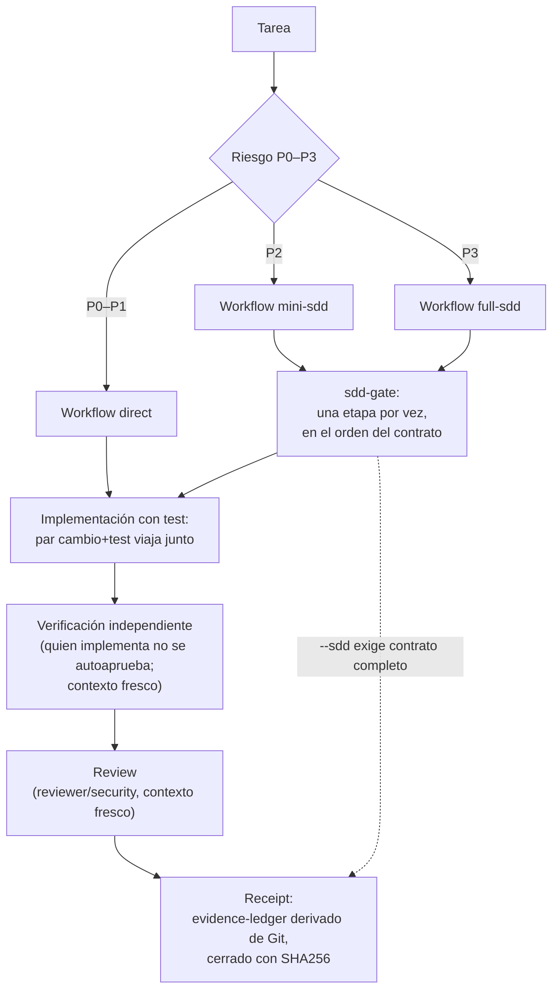

# Evidencia y receipts

La regla central del bundle: **ninguna afirmación de "hecho", "funciona" o
"roto" sin evidencia observable** — salida de test, `git diff`, exit code o
salida literal de comando. "Debería funcionar" es hipótesis, no resultado.
Y la parte que hace que la regla no dependa de la buena voluntad del agente:
**el recibo lo deriva Git; el relato no participa.** Los scripts de esta
página solo aceptan hechos que Git y los comandos ejecutados pueden
demostrar; lo que el agente afirma sobre su propio trabajo no entra en el
registro.

Los artefactos viven en `.evidence/` bajo el repo (ignorado por Git: es
estado local de corridas). La política exige publicar la evidencia junto al
resultado — comando, salida relevante y exit code — no un resumen verbal.
Norma completa: [`policy/AGENTS.md`](../policy/AGENTS.md) §5.

## El ciclo TDD observado

[`scripts/red-green.ts`](../scripts/red-green.ts) convierte el ciclo
RED → GREEN → TRIANGULATE → REFACTOR (skill `tdd-evidence`) en evidencia
capturada: cada fase ejecuta el comando de test real, observa su exit code y
guarda stdout/stderr (recortados a 20 000 caracteres por corriente).

| Fase | Exige | Rechaza |
|------|-------|---------|
| `record-red` | que el test **falle** (exit ≠ 0) | un RED que pasa (exit 0: "el test no prueba nada nuevo"); un ciclo RED pendiente sin cerrar |
| `record-green` | que el test **pase** tras editar el código | GREEN que falla (el ciclo queda abierto); no tener RED pendiente |
| `record-triangulate` | ciclo RED→GREEN cerrado, sin triangulación previa, y pase | registrar TRIANGULATE dos veces |
| `record-refactor` | TRIANGULATE registrado primero, y pase posterior a refactorizar | refactorizar sin triangulación previa |

El par RED→GREEN queda marcado `VALID` solo si el rojo fue rojo de verdad
(exit ≠ 0 registrado); los ciclos posteriores completan el registro y, con
TRIANGULATE + REFACTOR encima de un ciclo válido, lo marcan `COMPLETE`.

Archivos que deja en `.evidence/`:

| Archivo | Contenido |
|---------|-----------|
| `red-green.pending.json` | RED abierta (comando, exit code, salidas); se consume al cerrar el par |
| `red-green-<epoch>.json` | registro definitivo del ciclo: `cycle` VALID/INVALID, red, green, triangulate, refactor, `complete` |
| `red-green.latest.json` | puntero al último ciclo cerrado (lo consumen TRIANGULATE/REFACTOR) |

Detalle de robustez deliberado: al cerrar el par se escribe primero el
registro definitivo y el puntero, y recién después se consume el pendiente —
un corte entre pasos nunca pierde el ciclo ni lo atribuye al anterior.

Exit codes: `0` solo en una fase válida del ciclo; `1` fase inválida o
comando que ni siquiera pudo ejecutarse (ENOENT/EACCES — registrarlo sería
fabricar evidencia); `2` uso inválido.

Por qué tanto aparato: **un test que nunca se vio rojo no prueba el fix**
(policy §5). Un GREEN sin RED observada es compatible con un test que siempre
pasó — y por lo tanto no ejercita nada. El script vuelve ese argumento
mecánico: sin rojo registrado, no hay ciclo.

## El receipt de misión

[`scripts/evidence-ledger.ts`](../scripts/evidence-ledger.ts) genera el
recibo YAML de cierre de misión. El agente AFIRMA menos y el sistema REGISTRA
más: todos los campos derivan de Git o de comandos ejecutados en el momento.

```bash
node scripts/evidence-ledger.ts \
  --mission feat-auth-refresh \
  --base 82ac31 \
  [--expected 9] \
  [--sdd feat-auth-refresh] \
  --check "unit tests" -- "pnpm test" \
  [--check "lint" -- "pnpm lint"] …
```

Campos del recibo (escrito a `.evidence/mission-<mission>-<ts>-<rand>.yaml`):

| Campo | Origen |
|-------|--------|
| `mission`, `recordedAt`, `repository` | argumento CLI + reloj + cwd |
| `git.baseSha` / `git.candidateSha` | `--base` (obligatorio) y `--candidate` (default: `git rev-parse HEAD`) |
| `git.baseIsAncestorOfCandidate` | `git merge-base --is-ancestor base candidate` |
| `git.changedFiles` / `git.filesChanged` | `git diff --name-only base..candidate` |
| `git.expectedFiles` / `git.scopeMatchesExpectation` | flag `--expected`; comparación contra el diff real (`null` si no se pasa) |
| `git.insertions` / `git.deletions` | `git diff --shortstat base..candidate` |
| `verification[]` | cada `--check "<label>" -- <cmd>` ejecutado de verdad: label, comando, exit code, passed |
| `sdd` | solo con `--sdd <misión>`: verdict del gate SDD (ver abajo) |
| `verdict` | PASS o FAIL, según la regla siguiente |
| `sha256` | hash SHA-256 del cuerpo completo del recibo, escrito como línea final |

Regla de veredicto — PASS **solo si**:

1. la base es ancestro del candidato;
2. **todas** las verificaciones pasan (y hay al menos una: un recibo sin
   ningún `--check` es FAIL);
3. si hubo `--sdd`, todas las etapas del contrato están completadas;
4. el scope no discrepa (con `--expected`, el conteo debe coincidir; sin el
   flag, este criterio no penaliza).

El cierre SHA256 hace al recibo verificable a posteriori: cualquier edición
del cuerpo invalida el hash. Exit codes: `0` PASS; `1` FAIL, incluido el caso
`--sdd` sin estado (`✘ --sdd '<misión>': no existe .evidence/sdd-<misión>.json
(¿corriste sdd-gate start?)`).

## sdd-gate: el orden exigido

[`scripts/sdd-gate.ts`](../scripts/sdd-gate.ts) hace que saltarse una etapa
del workflow elegido **falle mecánicamente**. Cada transición se registra en
`.evidence/sdd-<mission>.json` validando que la etapa sea exactamente la
siguiente esperada por el contrato declarado en `contracts/<workflow>.json`
(del checkout del bundle).

| Subcomando | Uso | Efecto |
|------------|-----|--------|
| `start` | `--workflow direct\|mini-sdd\|full-sdd --mission <nombre>` | crea el estado con las etapas del contrato; niega re-inicio sin `--force` |
| `advance` | `--mission <nombre> --stage <id> --note "evidencia"` | completa la etapa **solo si es la siguiente esperada** |
| `status` | `--mission <nombre>` | lista las etapas con ✔/· y su nota |
| `verify` | `--mission <nombre>` | exit 0 solo con todas las etapas completadas |

Orden exigido por cada contrato:

| Workflow | Riesgo | Etapas en orden |
|----------|--------|-----------------|
| `direct` | P0–P1 | understand → change → verify → summarize |
| `mini-sdd` | P2 | propuesta → confirmacion → implementacion → verificacion-independiente → resumen-evidencia |
| `full-sdd` | P3 | explore → proposal → spec → design → tasks → apply → verify → review → archive |

Saltarse una etapa produce exit 1 con el mensaje literal
`✘ GATE VIOLADO: la etapa esperada es '<X>', no '<Y>'. El contrato <workflow>
exige orden estricto.` Exit codes del gate: `0` OK · `1` gate violado o
misión incompleta · `2` uso inválido.

Los contratos son machine-readable y están validados:
[`schemas/stage-contract.schema.json`](../schemas/stage-contract.schema.json)
define estructura obligatoria por etapa (inputs, outputs, exit_criteria,
perfil de modelo, presupuesto de contexto §7, tools permitidas, política de
memoria), y [`scripts/verify-contracts.ts`](../scripts/verify-contracts.ts)
(parte de `pnpm verify`) cruza cada etapa contra el encabezado real que ocupa
en su documento de workflow — contrato y documento no pueden derivar por
separado.

Cierre de circuito: `evidence-ledger --sdd <misión>` lee ese mismo estado y
**niega el PASS** a misiones SDD incompletas. Sin gate no hay recibo; sin
recibo no hay misión completa.

## Mini-bench driven

Un test verde sobre [`bench/corpus.ts`](../bench/corpus.ts) solo valida
**declaraciones**: que los journeys estén bien formados, no que los mecanismos
ejecuten lo que prometen. La única prueba de ejecución es el runner
[`scripts/dream-bench.ts`](../scripts/dream-bench.ts) (**modo driven**):
ejecuta cada step real con `bash -c` desde la raíz del repo, observa exit
code y salidas, y emite veredicto por journey — jamás fabrica un resultado
para mover la columna.

Corpus actual (ejes de vocabulario cerrado: gates, evidence, composition,
observability):

| Journey | Eje | Qué prueba ejecutando |
|---------|-----|------------------------|
| j1 | gates | security-gate bloquea el P5 (exit 1) y permite un comando inocuo (exit 0) |
| j2 | gates | sdd-gate viola el orden de contracts/direct.json cuando se salta etapas |
| j3 | evidence | dream-manifest.sh detecta drift post-instalación (exit 1 nombrando el artefacto) |
| j4 | observability | context-governor emite veredicto coherente o limitación declarada |
| j5 | composition | dream-doctor declara la instalación saludable (exit 0) |
| j6 | composition | el override del bundle aparece en la config compuesta (`dsh --dump-config`) |
| j7 | evidence | specs SDD: new→sync; spec inválida NO se archiva; archivada lleva SHA-256 en el índice |
| j8 | gates | cc-hook-guard decide por exit code: P5/ruta sensible → 2, inocuo → 0 |

Cada step declara `shell`, `expectExit` (default 0; admite lista),
`expectStdout`/`expectStderr` (RegExp). Timeout de 120 s por step; el runner
inyecta `DSH_BENCH_RUN_ID` para aislar estado entre corridas concurrentes.

```console
$ pnpm bench                 # corpus completo
$ pnpm bench --only j1,j2    # subset (ids separados por coma)
$ pnpm bench --list          # enumera el corpus sin ejecutar nada
$ pnpm bench --json          # UN objeto JSON machine-readable por stdout
```

Recibo: `.evidence/bench-latest.json` (escritura atómica tmp+rename: dos
benches concurrentes nunca dejan un recibo a medias) más una copia sellada
`.evidence/bench-<epoch>.json`. Campos: `kind: dream-bench`,
`drivenMode: true`, `runId`, `corpusSize`,
`totals {completed, failed[, skipped]}` y el veredicto por journey
(`failedStep` y `detail` en los fallidos). Exit codes: `0` todos los journeys
completaron · `1` alguno falló · `2` corpus inválido (declaraciones) · `4`
uso inválido o `--only` sin match.

En CI, el job Tooling corre el subset sin dependencias de host:
`node scripts/dream-bench.ts --only j1,j2,j3,j7,j8`. Los journeys j4–j6
exigen una instalación dsh real y quedan como gate autoritativo local
(`pnpm bench` completo).

## Contexto como presupuesto

El contexto es presupuesto finito que se administra, no un recurso que se
agota en silencio (policy §7). La presión se **mide**, no se intuye:
[`scripts/context-governor.ts`](../scripts/context-governor.ts) lee el uso
LLM real de la sesión (chunks `usage` del session log, leído por streaming;
los logs zstd se descomprimen vía archivo temporal) y emite un evento
machine-readable por ejecución:

| Evento | Umbral (default) | Obligación según policy §7 |
|--------|------------------|----------------------------|
| `context:ok` | ratio < 0.80 | seguir trabajando |
| `context:warning` | ratio ≥ 0.80 | cerrar la unidad en curso y preparar compactación |
| `context:critical` | ratio ≥ 0.92 | compactar YA: persistir por memory-gate lo imprescindible y re-anclar |

Umbrales alineados con la compactación nativa del perfil (`thresholdRatio`
0.8) para dejar margen; son ajustables con `--window`, `--warning` y
`--critical` (además de `--session`, `--sessions-dir`, `--evidence-dir`,
`--json`). El warning 0.80 no es casualidad: es el punto donde todavía se
puede cerrar limpio en lugar de perder la unidad a mitad.

Tabla completa de exit codes — cada código es exclusivo y componible como
gate:

| Exit | Significado |
|------|-------------|
| 0 | `context:ok` — seguir trabajando |
| 1 | `context:warning` — cerrar la unidad en curso |
| 2 | `context:critical` — compactar ya |
| 3 | sin datos de uso (sesión recién abierta): limitación **declarada**, nada simulado |
| 4 | uso inválido de CLI — jamás colisiona con un veredicto |
| 5 | error de infraestructura (log ilegible, zstd ausente/corrupto, EACCES) |

Cada veredicto queda registrado en `.evidence/context-events.jsonl` (con
rotación a `context-events.1.jsonl` al superar 4 MB). Si el registro no puede
escribirse, el gate avisa por stderr pero jamás falsea el veredicto. Una
tarea que excede el contexto disponible se divide en misiones encadenadas,
cada una con su recibo `evidence-ledger` — no en un turno gigante.

## El flujo completo



## Ver también

- [Seguridad](security.md) — la otra cara mecánica: qué comandos ni llegan a
  convertirse en evidencia.
- [Arquitectura](architecture.md) — contratos por etapa y gobernanza de
  contexto en el diseño general.
- [Skills reference](skills-reference.md) — `tdd-evidence` y
  `evidence-ledger`: la capa procedimental de estas mismas reglas.
